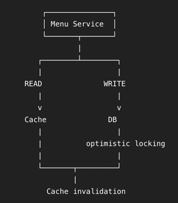

# Menu System

## Problem Statement
Design a menu system. Restaurants manage categories and items: create, change price, toggle availability, delete. Customers browse menus very heavily. Handle concurrent updates and add caching.

## Ideation
- reads are heavy, rare write
- Restaurant has Category (1 to many)
- Category has Item (1 to many)
- Restaurant can create, update, delete Category; create, update, delete Item; toggleAvailability of Item; change price of Item
- Custom can getMenu(restaurantId) 

### Example: Restaurant: Pizza Hut
- Pizza Hut has categories: Pizza, Sides, Desserts, Drinks
- Pizza has items: Margherita ₹299 AVAILABLE, Farmhouse ₹399 AVAILABLE, ...
- Sides has items: Garlic Bread ₹149 AVAILABLE, Wings ₹249 UNAVAILABLE, ... 
- Desserts has items: Brownie ₹129 AVAILABLE, ... 
- Drinks has items: Coke ₹129 AVAILABLE, ...

## Basic Design:
 

*keeping concurrency as a second step  

- Cache contains the entire menu: menu:{restaurantId} e.g. menu:R123 

## Entities 
- Restaurant (has Menu)
- Menu (has Category, Menu does not exist outside Restaurant)
- Category (has Item, Category does not exist outside Menu)
- Item (has ItemStatus, price, id, name, Item does not exist outside Category)
- ItemStatus - enum AVAILABLE, UNAVAILABLE
- MenuRepository interface (is used by MenuService as a data source)
- MenuCache interface (is used by MenuService for caching)
- MenuService is the main service that handles business logic